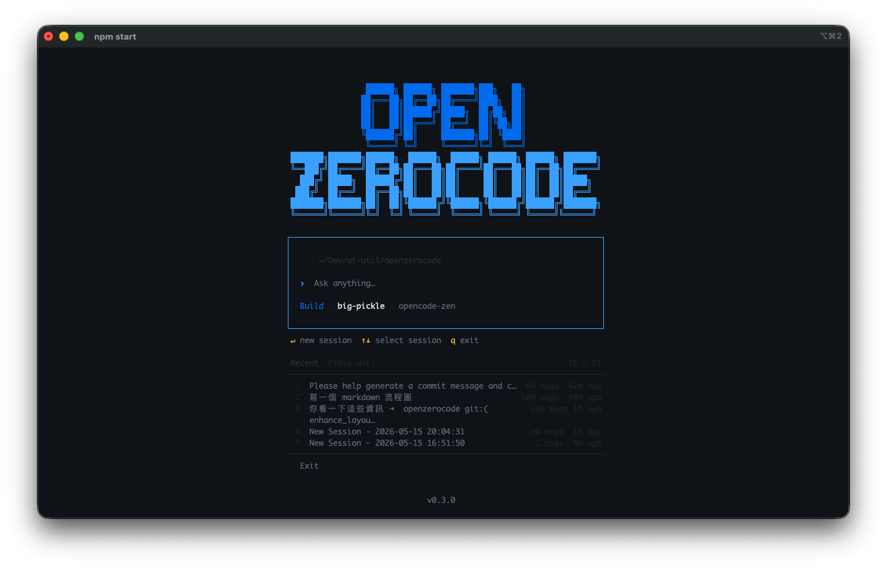
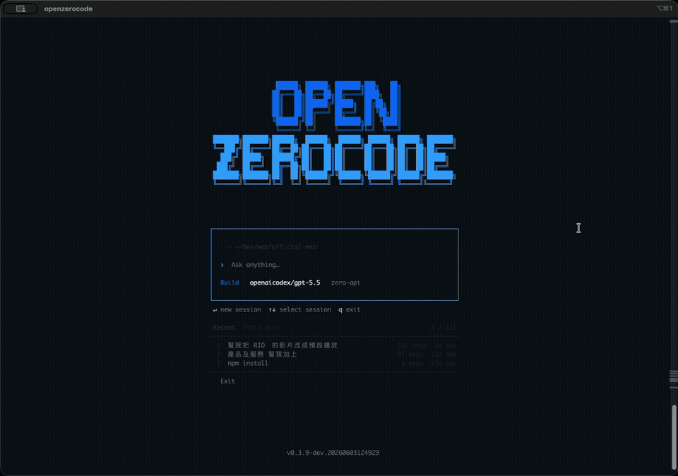

# OpenZeroCode

[繁體中文](./README.zh-TW.md) | [简体中文](./README.zh-CN.md)

> **Terminal-first AI coding agent — inspired by [OpenCode](https://github.com/sst/opencode).**

OpenZeroCode is a local-first, TUI-driven AI coding assistant adapted from the OpenCode direction. It strips away the `zero` cloud dependency and focuses on a self-contained terminal experience with built-in tooling, multi-provider support, and working memory.



---

## Inspiration

This project is **heavily inspired by OpenCode**, a terminal-native AI coding agent. OpenZeroCode started as a fork of OpenCode's architecture and has since evolved its own identity:

- **Same foundation**: SolidJS terminal UI (`@opentui`), provider abstraction, tool system, session persistence
- **Different focus**: Local-first, independent of the `zero` ecosystem, extensible for custom workflows
- **Shared lineage**: Provider registry, tool registration, and build pipeline patterns derive from OpenCode

We're grateful for the OpenCode project's design — this project wouldn't exist without it.

---

## Current State

This repo is actively implemented. Current capabilities include:

- **Solid-based terminal UI** in `src/client/tui.tsx` — streaming responses, reasoning display, command palette
- **Build / Plan mode** toggle for structured vs. free-form agent behavior
- **Provider switching** — OpenCode Zen, OpenAI, OpenAI Codex, OpenRouter, Zero-API, DeepSeek, plus configurable OpenAI-compatible endpoints
- **Model switching** — switch models on the fly
- **Multi-session persistence** under `~/.openzerocode/sessions`
- **Session management** — rename, delete, compact, timeline actions (revert/copy/fork)
- **Headless and server modes** — `--run` for one-shot CLI runs and `serve` for the streaming HTTP API
- **Sidebar context** — token usage, cost tracking, git diff summary
- **Workspace prompt memory** — `AGENTS.md` instructions + `CONTEXT.md` project context injected into the system prompt
- **Session handoff** — `SESSION_SUMMARY.md` for concise local continuation notes
- **GEASS browser tools** — optional browser navigation, reading, interaction, screenshots, and visual observation
- **16 built-in tools**:
  | Tool | Description |
  |------|-------------|
  | `read` | Read file contents |
  | `write` | Write / overwrite files |
  | `grep` | Search file contents by pattern |
  | `glob` | Find files by glob pattern |
  | `bash` | Execute shell commands |
  | `edit` | Targeted string replacement edits |
  | `web-fetch` | Fetch content from URLs |
  | `todo-write` | Maintain structured task lists during multi-step work |
  | `browser-navigate` | Navigate the connected GEASS browser to a URL |
  | `browser-read` | Read structured content from the current GEASS browser page |
  | `browser-click` | Click page elements in the GEASS browser |
  | `browser-type` | Type into inputs in the GEASS browser |
  | `browser-select` | Select dropdown options in the GEASS browser |
  | `browser-scroll` | Scroll the current GEASS browser page |
  | `browser-screenshot` | Capture a browser screenshot |
  | `browser-observe-visual` | Inspect the current browser view visually |



---

## Quick Start

### Prerequisites

For source development, use **bun** ≥ 1.2 and **npm** on your `PATH`.

### Install script

The release installer follows opencode's user-level install style: it installs the binary to `~/.openzerocode/bin` and updates your shell config to add that directory to `PATH` when needed.

```bash
curl -fsSL https://github.com/arborlogic/openzerocode/releases/latest/download/install | bash
```

Use `--no-modify-path` if you want to update `PATH` manually, or set `OPENZEROCODE_INSTALL_DIR` to choose a different writable install directory.

### Install from npm

Supported prebuilt npm targets:

- `darwin-arm64`
- `linux-x64`
- `linux-arm64`
- `win32-x64`

Install with:

```bash
npm install -g openzerocode
```

The root package installs a small Node launcher and resolves the matching optional platform package at runtime.

### Install from source

```bash
git clone https://github.com/arborlogic/openzerocode.git
cd openzerocode
python3 scripts/dev-install.py
```

This remains the supported local development install path. It installs dependencies, rebuilds `dist/openzerocode` with a timestamped `-dev.YYYYMMDDHHMMSS` version suffix, and runs `npm install -g .` so the global `openzerocode` command points at that locally built binary.

### Run

```bash
openzerocode
```

### Development mode

```bash
npm run dev
```

### Updating

```bash
git pull
python3 scripts/dev-install.py
```

That refreshes dependencies, rebuilds the binary, and reinstalls the global `openzerocode` command from your local checkout.

### npm packaging workflow

The published npm artifacts use a "root launcher + platform packages" structure:

- Root package `openzerocode` ships only the Node launcher `bin/openzerocode.js`
- Platform binaries live in `@openzerocode/<target>` optional dependencies
- Currently supported targets: `darwin-arm64`, `linux-x64`, `linux-arm64`, `win32-x64`

Typical workflow:

1. **Build the local binary**

   ```bash
   npm run build
   ```

   This runs `scripts/build.sh` and outputs `dist/openzerocode` by default.

2. **Generate the `npm/` publishing staging layout**

   ```bash
   node scripts/create-platform-packages.mjs
   ```

   This creates:

   - `npm/package.json`: root npm package manifest
   - `npm/bin/openzerocode.js`: launcher that dispatches to the matching platform binary
   - `npm/packages/<target>/package.json`: manifest for each platform package
   - `npm/README.md`, `npm/LICENSE`, `npm/bin/package.json`: supporting publish files

3. **Build each platform binary on its native platform**

   ```bash
   scripts/build-platform-package.sh darwin-arm64
   scripts/build-platform-package.sh linux-x64
   scripts/build-platform-package.sh linux-arm64
   scripts/build-platform-package.sh win32-x64
   ```

   `scripts/build-platform-package.sh` must run on the matching host platform. For example, `linux-arm64` must be built on a `linux-arm64` machine. Successful builds output binaries to:

   - `npm/packages/<target>/bin/openzerocode`
   - Windows target: `npm/packages/win32-x64/bin/openzerocode.exe`

4. **Pack / publish the npm packages**

   After staging and building the platform binaries, run `npm pack` or `npm publish` inside `npm/` and each `npm/packages/<target>/` directory.

   Recommended order:

   - Publish platform packages `@openzerocode/<target>` first
   - Publish the root package `openzerocode` second

5. **Release checklist**

   First add a real `CHANGELOG.md` entry for the target version. Then use the release script to prepare the version bump, release commit, and matching git tag:

   ```bash
   npm run release -- patch       # or: minor, major, explicit version such as 0.4.3
   npm run release -- patch --dry-run
   npm run release -- patch --push
   ```

   The script requires no unrelated working-tree changes, validates that `CHANGELOG.md` already contains the target version entry, updates `package.json` and `package-lock.json` if present, stages the changelog entry, runs `npm run typecheck` by default, commits `chore: release v<version>`, and creates the `v<version>` tag. Use `--no-verify` only when you intentionally want to skip typecheck.

   Before and after a release, verify:

   - Confirm the target version changelog entry is complete before running the release script
   - If you did not pass `--push`, push both the release commit and tag: `git push origin HEAD && git push origin v<version>`
   - `.github/workflows/build.yml` always builds and uploads root/platform npm tarballs plus direct binary release archives (`.tar.gz` for Linux/macOS, `.zip` for Windows)
   - Tag pushes create a matching GitHub Release with those artifacts and automatically publish npm packages
   - npm publishing publishes platform packages first and then the root `openzerocode` package, skipping versions that already exist
   - If a workflow failed and only needs a rerun, use `workflow_dispatch` from the Actions page; no version bump or rerun of the release script is needed in that case. Enable `publish_to_npm` to rerun npm publishing, or provide the existing tag and enable the release option to recreate/update the GitHub Release
   - After publishing, verify `openzerocode --version` from the GitHub Release artifacts and verify `npm install -g openzerocode`

This structure keeps `npm install -g openzerocode` lightweight while npm resolves the real executable from the platform-specific optional package.

### Command-line usage

```bash
openzerocode                         # Launch the TUI
openzerocode --version               # Print version
openzerocode --help                  # Print CLI help
openzerocode --run "fix the tests"    # Run one prompt headlessly with auto-approved tools
openzerocode serve --port 4096       # Start the streaming HTTP API server
```

Environment overrides:

| Variable | Effect |
|----------|--------|
| `OPENZERO_MODEL` | Override the default model used by headless `--run` mode |
| `OPENZEROCODE_PROVIDER_CONFIG` | Override the provider config path (default `~/.openzerocode/providers.json`) |

### Alternative entrypoint

```bash
npm run start:tui
```

---

## Provider Configuration

Provider credentials can be set through environment variables or a local config file:

```text
~/.openzerocode/providers.json
```

Shape:

```json
{
  "providers": {
    "openrouter": {
      "activeKey": "default",
      "keys": {
        "default": "sk-or-...",
        "backup": "sk-or-..."
      },
      "baseURL": "https://openrouter.ai/api/v1"
    }
  }
}
```

**Supported providers:**

| Provider id | Name | Environment keys |
|-------------|------|------------------|
| `opencode-zen` | OpenCode Zen | `OPENCODE_API`, `OPENCODE_API_KEY` (optional; anonymous free models are available) |
| `openai` | OpenAI | `OPENAI_API_KEY` |
| `openai-codex` | OpenAI Codex | ChatGPT OAuth via `/codex-login` |
| `openrouter` | OpenRouter | `OPENROUTER_API_KEY` |
| `zero-api` | Zero-API-compatible local endpoint | `ZERO_API_KEY` |
| `deepseek` | DeepSeek | `DEEPSEEK_API_KEY` |

**Notes:**

- Each provider can have multiple named keys.
- `activeKey` selects which key the runtime uses for that provider.
- `baseURL` can override a provider's default endpoint for compatible APIs.
- Config file values take precedence over environment variables.
- You can inspect and switch providers, models, and keys inside the TUI with slash commands and the command palette.

---

## Development

```bash
# Type check
npm run typecheck

# Run all unit tests (excludes provider-integration tests)
npm run test:unit

# Run a single test file
npx tsx --test src/client/workspace-memory.test.ts
```

See [DEVELOPMENT.md](./DEVELOPMENT.md) for detailed guidance on:
- Building standalone binaries
- Cross-platform distribution
- The build system & `Bun.build()` compilation

---

## Architecture

```text
┌─ TUI client ──────────────────────────────────┐
│  src/client/tui.tsx                            │
│  - transcript / response rendering             │
│  - command palette & autocomplete              │
│  - session management (create, rename, delete) │
│  - build / plan mode toggle                    │
│  - sidebar: token usage, cost, git summary     │
│  - workspace memory + skill injection          │
└────────┬───────────────────────────────────────┘
         │
         ├── provider layer ─────────────────────┐
         │  src/provider/registry.ts             │
         │  - OpenCode Zen (opencode-zen)         │
         │  - OpenAI / OpenAI Codex              │
         │  - OpenRouter / Zero-API / DeepSeek   │
         │  - Extensible via registry            │
         └───────────────────────────────────────┘
         │
         └── tool layer ─────────────────────────┐
            src/tool/registry.ts                 │
            - file/search/shell/edit/web tools    │
            - todo + GEASS browser tools         │
            - Permission / auto-approve system   │
            └────────────────────────────────────┘
```

## Workspace Memory Model

OpenZeroCode separates repo memory into three lightweight artifacts:

- `AGENTS.md`: stable repo-specific instructions, workflows, and guardrails.
- `CONTEXT.md`: background context, shared vocabulary, and known mismatches worth surfacing in prompts.
- `SESSION_SUMMARY.md`: concise handoff notes for humans/continuation; not auto-injected into the system prompt.

The current automatic prompt assembly path loads `AGENTS.md` and `CONTEXT.md` from the nearest workspace via `src/client/workspace-memory.ts`.

### Key source files

| File | Purpose |
|------|---------|
| `src/client/tui.tsx` | Main TUI entrypoint & UI orchestration |
| `src/client/sessions.ts` | Session persistence helpers |
| `src/client/workspace-memory.ts` | Loads `AGENTS.md` and `CONTEXT.md` into the system prompt |
| `SESSION_SUMMARY.md` | Manual session handoff / continuation notes |
| `src/provider/registry.ts` | Provider registration & resolution |
| `src/tool/registry.ts` | Built-in tool registration |
| `src/server/index.ts` | Streaming HTTP API server for `openzerocode serve` |

---

## Relationship to OpenCode

| Aspect | OpenCode | OpenZeroCode |
|--------|----------|--------------|
| **Runtime** | Requires `zero` cloud service | Self-contained, local-first |
| **TUI framework** | `@opentui` (SolidJS) | `@opentui` (SolidJS) — same |
| **Provider layer** | OpenRouter, others | OpenCode Zen, OpenAI, OpenAI Codex, OpenRouter, Zero-API, DeepSeek, extensible |
| **Tool system** | Built-in tools | File/search/shell/edit/web tools + todo + GEASS browser tools + permission system |
| **Session storage** | Local files | Local files under `~/.openzerocode/` |
| **Prompt memory** | Varies | `AGENTS.md` + `CONTEXT.md` are injected into the local system prompt |
| **Cloud dependency** | Requires `zero` for operation | None — works entirely offline |
| **Binary distribution** | Platform-specific npm packages | Platform-specific npm packages (`darwin-arm64`, `linux-x64`, `linux-arm64`, `win32-x64`) plus source-first local install via `python3 scripts/dev-install.py` |

---

## License

MIT — see [LICENSE](./LICENSE).
